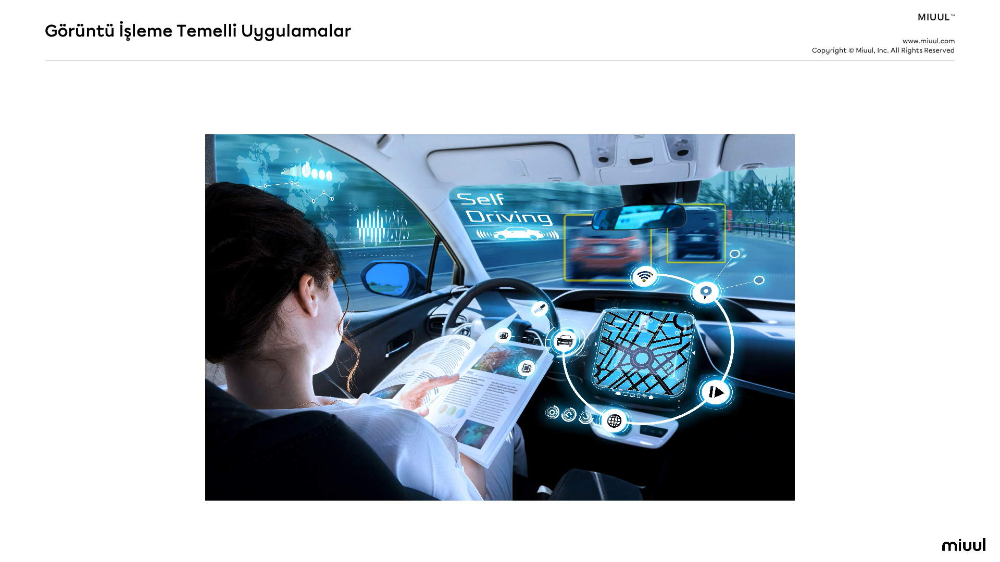

# Veri Bilimi ve Yapay Zekaya Giriş
## Giriş 
- Yapay Zeka Çağına Hazır Mısınız?

- Yapay Zeka Çağında Hayatta Kalmak

- Sizi Sizden Daha İyi Tanıyan Algoritmalar!

- 21.Yüzyılın En Değerli Mesleği

- Veriden Faydalı Bilgi Çıkarmak

- Bir Örnek ile Genel Resim

## Yapay Zeka Çağına Hazır Mısınız?
- Dünyanın en değerli kaynağı artık petrol değil veridir!

- Yapay zeka yeni elektriktir.

- Yapay zeka bir bilgisayarın veya bilgisayar kontrolündeki bir robotun çeşitli faaliyetleri zeki canlılara benzer şekilde yerine getirme kabiliyetidir.

### Sosyal Medya ve İnternette Yapay Zeka
- Arkadaş Önerileri

- Otomatik fotoğraf etiketlemeleri 

  
- Hedefli içerik pazarlama 

- Otomatik mesaj tamamlama

- Hedefli ürün pazarlama 

- Tavsiye sistemleri

## Farklı Alanlardan Örnek Uygulamalar
- Müşteri Segmantasyonu 

- Kanser/Hastalık teşhisi

- Şirketlerin gelir tahmini ile strateji belirlemesi

- Başvuru değerlendirme sistemleri

- Akıllı portföy yönetimi

- Doğal afet modelleme çalışmaları

- E-Spor Analitiği

 

## Görüntü İşleme Temelli Uygulamalar
- Otonom araçlar

 

- Nesne tanıma/takip uygulamaları

- Sahte videolar

- Eski resimlerin canlandırılması

- Algoritmaların geliştirdiği resimler/var olmayan kişiler 

- Robotlar!

 
 

## Yapay Zeka Çağında Hayatta Kalmak

- Programlama

- Matematik

- İstatistik

- Veri Analizi

- Veri Bilimi

- Büyük Veri

- Yapay Zeka

- Derin Öğrenme

- Makine Öğrenmesi

- Nesnelerin İnterneti

- Endüstri 4.0

- Veri Madenciliği

- Veri Analitiği ve Analitik Düşünce Becerileri

- Yeni sorular sormak

- Araştırma

- Problem çözme

- Kavramların mantıklarına odaklanmak

- Kişinin alışkanlıkları ve tercihlerine yönelik çeşitli çıkarımlar

## Sizi Sizden Daha İyi Tanıyan Algoritmalar

## Veri Bilimi ve Veri Bilimcilik

## Veriden Faydalı Bilgi Çıkarmak

## İş Anlayışı - İş Problemi

## Veriyi Anlamak

## Verinin Hazırlanması

