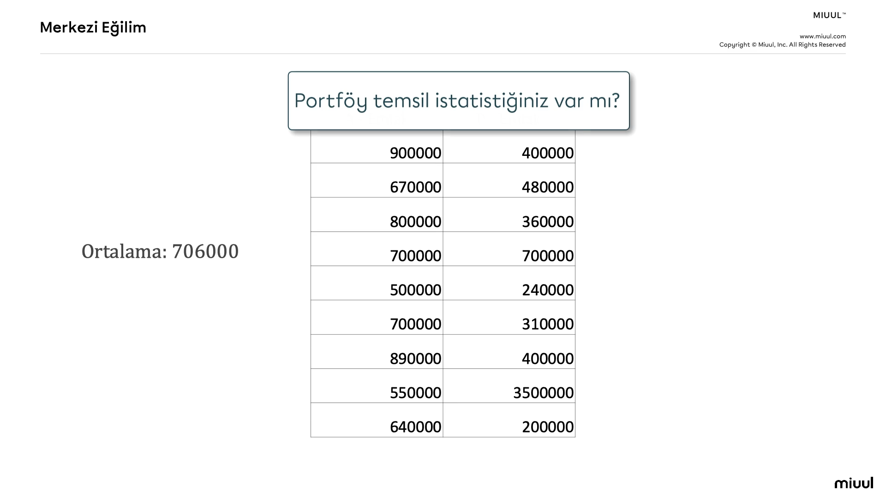
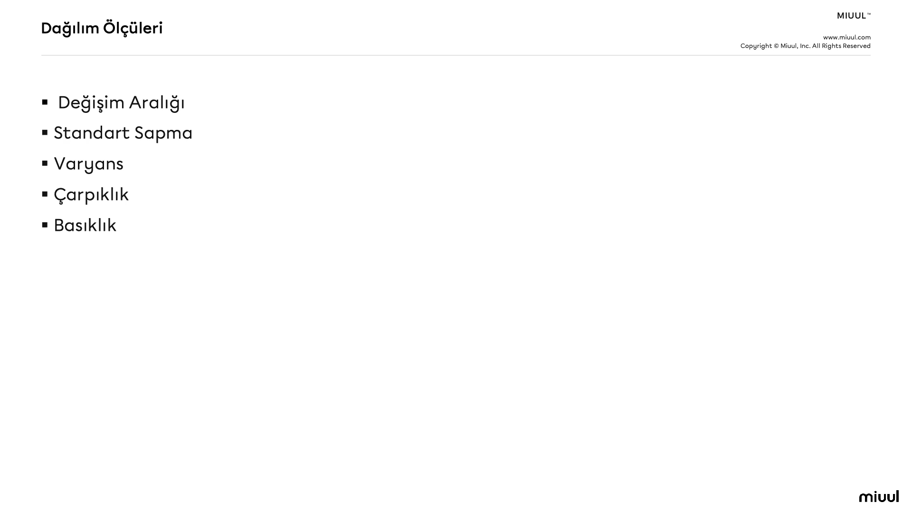
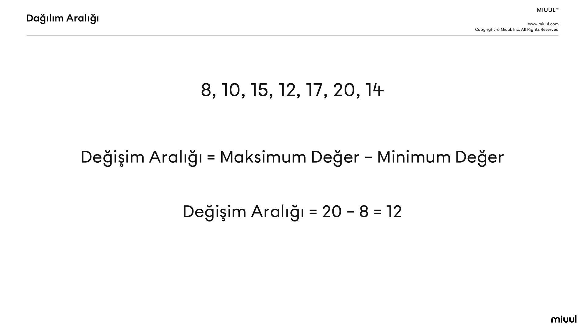
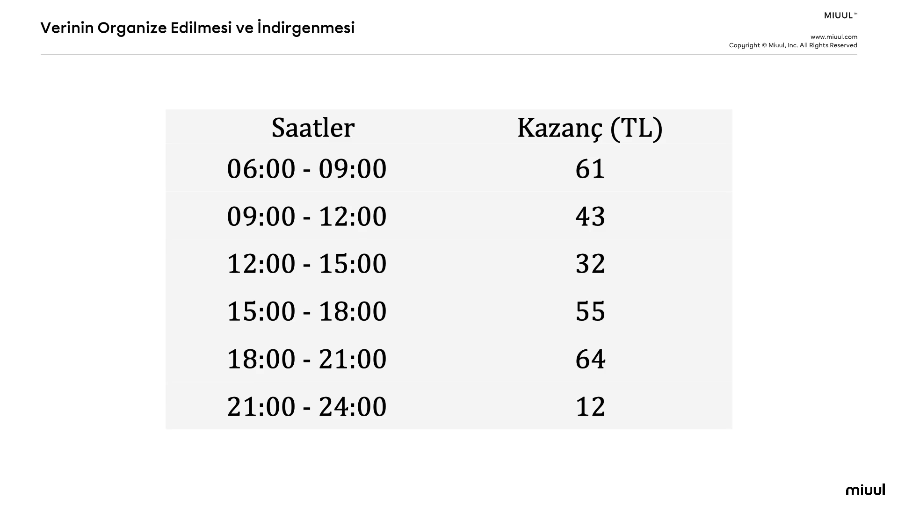

# Veri Okuryazarlığı
## Giriş
- Veri Okuryazarlığı Nedir?
    * Günlük hayatımızda veriyle ilk temas ettiğimizdeki yorumlama kabiliyeti.
- Temel Kavramlar
- Merkezi Eğilim Ölçüleri
    * Elimizdeki değişkenleri yani veriyi yorumlayabilmek adına ilk önce başvuracak olduğumuz yapıdır.
- Dağılım Ölçüleri
    * Elimizdeki değişkenin dağılımına ilişkin bazı istatistiksel yapılardır.
- İstatistiksel Düşünce Modelleri
    * Bir birey olarak bizlerin veriyle ilk temas ettiği andan veriyi analitik becerileriyle değerlendirme noktasına kadar olan süreci akademik/bilimsel anlamda modelleyen yapılardır.

## Veri Okuryazarlığı Nedir?
- Günlük hayatta veriyle temas ettiğimiz ilk anlardaki basit veri yorumlama kabiliyetleridir.

- Veri Okuryazarlığı her türden veri tipini, değişken ve ölçek türlerini tanımlayabilme, betimsel istatistikleri ve istatistiksel grafikleri kullanarak veri değerlendirebilme yeteneğidir.

- Sadece teknik olarak önümüzdeki bir veriyi tanımlamaktan ziyade aslında burada bu veriler üstünde değerlendirmeler yorumlar yapabilmemk çok çok daha değerli tabiki.

- Bir bakkal Mehmet amcanın satışları not ettiği defteri okuması gerektiğinde, bir kurumsal şirkette çalışan yöneticinin bazı raporları değerlendirmesi gerektiğinde,yine bir şirkette bir toplantı ortamında çok basit bazı istatistiklerle konuşmak gerektiğinde, televizyonda seçim zamanlarında seçimlere ilişkin anket sonuçlarını değerlendirmek gerektiğinde, ulusal veya uluslararası ekonomik göstergelerle ilgili ucundan da olsa şöyle bir konuşabilmek gerektiğinde, bu veri okuryazarlığı konusu karşımıza çıkmaktadır.

- Veri okuryazarlığı sadece veriyle temas ettiğimiz anlarda yorumlama yapabilmekten ziyade eğer iş dünyasında siyasi dünyada veya buna benzer ortamlarda çeşitli konularla ilgili bazı genellemeler bazı yorumlar yapmak istersek işte bu veri okuryazarlığına sahip olmamız durumunda ilgili konuların ilgili kaynaklardan çeşitli istatistiklerini bulup konuşmalarımızı siyasi anlamda iş ortamı anlamında daha altı dolu sayılara ve bilime dayalı olarak yapma imkanını sağlar.

- Fakat veri okuryazarlığı yani istatistiksel okuryazarlık sayılarla merkezi eğilim dağılım ölçüleri gibi ölçülerle konuşulamayan bir dünyada elimizde çeşitli alanlara ilişkin istatistikler olsa dahi bunlar doğru bir şekilde değerlendirilemeyecektir.

- Veri okuryazarlığının önemli bileşenlerinden birisi veri görselleştirme teknikleri yani elimizdeki veriye bazı işlemler yapacaz yorumlayacağız ve başkalarının anlayabileceği şekilde de sunmamız gerekecek. 

- Yukarıdaki 1930 yılındaki Hakimiyet-i Milliye isimli bir dergiden/gazeteden alınmış bir görsel. Görselin konusu şu : Eğer gençliğinizde ve çocukluğunuzda tasarruf yapmazsanız ihtiyarlığınızda sefalet yaşarsınız.

- Elinizde doğru veriler olsa dahi bunları sunabiliyor olmanız gerekir veya birşey ifade ettiğinizde onu bilimsel anlamda verilerle desteklemeniz sizi daha iyi bir iletişimci yapar.

- Bu habere yerleştirilen 2 istatistik bu haberin ikna gücünü çok şiddetli bir şekilde değiştirmiştir.

## Popülasyon ve Örneklem
- Popülasyon ilgilendiğimiz ana kitlemizdir hedef kitlemizdir.

- Örneklem bu popülasyon yani ana kitle içerisinden seçilen bir alt kümedir.

- Araştırmacı, veri bilimci olarak bizler veriden faydalı bilgi çıkarmaya çalışıyoruz işte bu veriden faydalı bilgi çıkarma sürecinde bazen elimizde verinin hepsi bazen de ana veriyi temsil eden bir alt kümesi olur ve genellikle gerçek hayat uygulamalarında elimizde bütün veri olmazda işte bu veriyi temsil eden bir alt küme olur. İşte bu verinin tamamına popülasyon bu veriyi temsil eden alt kümeye ise örneklem denir. 

- Tabi burada önemli olan nokta farkındalığının olması gerektiği nokta buradaki örneklemin bu ana kitleyi yani popülasyonu çok iyi temsil etmesi gerektiğidir. Öyle ki bu örneklem günün sonunda biz tarafından bu popülasyoncamışcasına muamele görecek. Dolayısıyla elde ettiğimiz örneklemin popülasyonun niteliklerini/özelliklerini temsil etmesi ve yansız olması gerekir.

- Ana kitle içerisinden yani popülasyon içerisinden örneklem çekmek için kullanılan bazı yöntemler var. Tabakalı örnekleme, Rastgele örnekleme bu yöntemlerle elimizdeki kitle içerisinden yüksek temsil gücüne sahip yansız olduğunu varsaydığımız bir örnek çekip işte bu örneklem üzerinden çalışmalarımızı gerçekleştiriyoruz.

- Seçim zamanlarında A,B,C partilerine ilişkin yapılan anket sonuçları açıklanıyor Bugün seçim olsa hangi partiye oy verirsiniz vb diğer sorular şeklinde şimdi bu anketler yapıldığında bu anketler bütün Türkiye'ye yapılmıyor. Örneğin Türkiye'de 80 küsür milyon insan varsa bu insanların hepsine gidilmiyorda bu 80 milyon kişinin iyi bir temsilcisi olduğu varsayılan örneklem çekiliyor Türkiye'de bu rakam bilimsel olarak 2000 - 2500 gibi bir değerdir. Yani 80 milyonun her birisiyle görüşüp onlara bir soru sormak yerine bu 80 milyonun çok iyi temsil ettiği varsayılan ki bazı metotlarla bu gerçekleştiriliyor 2500 kişi üzerinden bir araştırma yapılıp bu yapılan araştırma neticesinde ortaya çıkan sonuçlar 80 milyonunluk Türkiye'nin hepsine genelleniyor. Belirli bir hatayı göze alarak. Örneğin %95 güvenilirlik ile %99 güvenilirlik ile şöyle şöyle oy oranları elde ediliyor şeklinde yani belirli bir güvende vererek belirli bir istatistiki ve olasıksal sapmayı da göz önünde bulundurarak bütün kitleyi incelemek yerine bu kitleyi temsil eden bir örnek üzerinden ilgili çalışmalar gerçekleştirilmiş oluyor.

## Gözlem Birimi
- Araştırmada incelediğimiz birimlerdir.

- İlgilendiğimiz ana kitle içerisinden bu ana kitleyi temsil ettiğini varsaydığımız bir alt küme seçtik. İşte buradaki alt küme içerisindeki her bir eleman incelediğimiz odaklandığımız ana birim işte gözlem birimi olarak adlandırılır.

- Örneğin seçim çalışmasına geri dönecek olursak anket yapılmak üzere mikrofon uzatılan her bir birey gözlem birimidir ya da bir modelleme çalışması bir makine öğrenmesi çalışması yapıldığında incelenen gözlem birimleri farklılaşacaktır. Mesela bir araç fiyat tahmin modeliyle ilgilendiğimizi düşünelim.

- Bakın burada araçlar var fiyatlar var kilometreler var vitesler var bu bir veri. İşte bu veri içerisindeki her bir satır gözlem birimidir. Buradaki sütunlar ise değişkenlerdir. Buradaki her bir satır gözlem birimidir yani araştırmamızın ana odak noktasıdır.

## Değişken ve Değişken Türleri
- Gözlem birimi çalışmadaki birimler odaklandığımız birimler.

- Değişken : Birimden birime farklı değerler alan niceliktir.

- KM değeri buradaki her bir satırda bunu göz önünde bulundurursak bakın birimden birime farklı değerler almış. Gözlem birimi çalışmadaki ana odak noktamız yani birimler değişkenler ise birimden birime farklı değerler alan niceliklerdir.

- Buradaki bütün değerlere değişken diyoruz. KM, Vites Türü, Hasar Durumu, Marka, Model, Araç Fiyatı bir değişken. Burada garip bir durum var burada işte bazıları sayısal bazıları metinsel bunlarda değişkenlerin türleridir. KM ve Araç Fiyatı burada sayısal değişken diğer değişkenler ise kategorik değişken.

- Değişkenler temelde ikiye ayrılır. 

### Değişken Türleri
- Sayısal Değişkenler(nicel, kantitatif)
- Kategorik Değişkenler(nitel, kalitatif)

- Cinsiyet kategorik değişkendir.
- Kadın Erkek ise bu kategorik değişkenin sınıflarıdır.

- Buradan hareketle Vites Türü kategorik değişkendir. Manuel ve Otomatik bu değişkenin sınıflarıdır. Markanın sınıfları ise A, B, C'dir. Model'de bir kategorik değişkendir bu kategorik değişkenin de sınıfları/kategorileri vardır.

- Rütbe kategorik değişkeninin sınıfları:
    * Onbaşı < Yüzbaşı < Binbaşı < Albay
    * Buradaki yapı biraz farklı sanki değişkenin kategorilerinin sınıfları arasında bir fark var. İşte burada devreye ölçek türleri giriyor.

## Ölçek Türleri
- Sayısal Değişkenler için: Aralık ve Oran
- Kategorik Değişkenler için: Nominal ve Ordinal

- Bir değişkenin değerlerini insan olarak okuyup anlayabilmemiz adına bunu ölçmemiz gerekiyor. Buradaki ölçmek ifadesi sayısal değişkenler ve kategorik değişkenler için ayrılıyor.

- Bir sıcaklık değeri olduğunda elimizde bu sıcaklık değişkeninin eksi değerlerde ve artı değerlerde alabileceğini biliyoruz değil mi? İşte bu tip eksi değerlerde alabilen yani başlangıç noktası sıfır olmayan değişkenlere aralık türüyle ölçülmüş aralık ölçek türüyle ölçülmüş deriz.

- Başlangıç noktası sıfır olmayan sayısal değişkenlerin ölçek türü aralıktır.

- Başlangıç noktasını sıfır kabul eden sayısal değişkenlerin ölçek türü orandır.

- Elimizde bir değişken olduğunu düşünelim bu değişkenin 0 değeri bir başlangıç noktası yani yokluğu ifade ediyorsa bu durumda bu sayısal değişken için bu değişken oran ölçeğiyle ölçülmüştür deriz.  

- Yukarıdaki örnekte araç fiyatı 0 olduğunda bu neyi ifade edecek? 0 bir değeri yok bir yokluk ifade edecek KM'yi düşünelim KM'de eğer bu sayısal değişkenin 0 olursa ne olacak KM'si de yok bakın bir yokluk ifade ediyor. 

- Aralık ölçek türü içinde ifade edildiği üzere bir sıcaklık değişkeni düşünebilirsiniz. Örneğin burada 100 km sonrasında ortalama sıcaklık gibi bir değer bir değişken olduğunda bu değişken eğer eksi değerlerde alabiliyorsa artı değerlerde alabiliyorsa bu değişkenin ölçek türü incelendiğinde bunu aralık ölçek türü demiş olacağız.

- Kategorik değişken text formatında string formatında olabilir netice itibariyle karakter formatındaki veriler değil mi? isimlendirmelerden oluşur kabaca. Örneğin cinsiyet kadın erkek metin formatında karakterlerden oluşan programlama dilinde string değerlerden oluşan bir değişken. Şimdi bu kategorik değişkenlerin sınıfları arasında fark olmadığında buna nominal ölçek türüyle ölçülmüştür.

- Cinsiyet kategorik değişkendir.
    * Kadın, Erkek ise bu kategorik değişkenin sınıflarıdır.
    * Kadın ve Erkek sınıfları arasında fark olmadığı için bu değişken nominal ölçek türüne sahiptir.

- Sınıflar arası fark olmasındaki durumunda ise ölçek türü ordinal ölçek türüdür. Rütbe isminde bir değişkenimiz olsun 

- Rütbe kategorik bir değişkendir.
    * Bu kategorik değişkenin sınıfları: Onbaşı < Yüzbaşı < Binbaşı < Albay
    * Değişkenin sınıfları arasında fark olduğu için Rütbe değişkeni ordinaldir.

- Eğitim Durumu kategorik bir değişkendir
    * Bu kategorik değişkenin sınıfları: İlkokul < Lise < Üniversite < Lisansüstü
    * Değişkenlerin sınıfları arasında fark olduğu için Eğitim Durumu değişkeni ordinaldir/sıralıdır.

## Aritmetik Ortalama
- Bir seride(değişkende) yer alan tüm değerlerin toplanması ve birim sayısına bölünmesi ile elde edilen istatistiktir.

- Aritmetik ortalama merkezi eğilim ölçülerinden en sık kullanılan ve elimizdeki bir değişkenin ya da serinin ortalamasını temsil edebilmek adına kullandığımız bir merkezi eğilim ölçüsü.

- Bizlerde elimize bir veri seti geldiğinde bu veri setinin içerisindeki tüm değişkenler için veya ilgilenmiş olduğumuz bazı değişkenler için ben bu veri setini bir tanıyayım şu değişkenlerin yapısını öğreneyim/inceleyeyim dediğinizde başvuracak olduğumuz ilk istatistiklerden birisidir.

- Web sitemizde kullanıcılarımızın geçirmiş olduğu sürelere ilişkin bir veri olsun işte herhangi bir kişisel blog adresimiz var veya buna benzer bir şirket sitemiz olsun. Bu sitemizde kullanıcılarımızın geçirdiği sürelerin kaydının tutulduğunu gözlemliyoruz. Örneğin bir kullanıcı 3Dk bir kullanıcı 160 sn olacak şekilde böyle bazı kullanıcıların bilgileri var. Anlaşıldı kullanıcıların her birinin ayrı ayrı web sitemizde geçirdiği süreler var amma acaba ortalama ne kadar süre geçiriyorlar. Bu kullanıcıları aşağı yukarı her birini temsil edecek bir değer elimizde olsun diyerek elimizdeki değişkenin değerin merkezi eğiliminin nerede olduğunu görebiliyoruz.

## Medyan
- Bir seriyi küçükten büyüğe veya büyükten küçüğe sıraladığımızda tam orta noktadan seriyi iki eşit parçaya ayıran değere medyan adı verilir.

- Yine elimizdeki serinin veya değişkenin merkezi eğilimiyle ilgili bilgi almak için kullandığımız bir istatistiktir.

- Medyanı hesaplamak için bir seriye odaklandığımızda serinin içermiş olduğu gözlem sayısına göre medyanın hesaplama işlemleri farklılaşmaktadır. Elimizde 5 değer olduğunda tam ortadaki değeri bulabiliriz 3. sayıdır. Çift sayılarda değerler olduğunda ise tam ortada kalan iki değerin ortalaması alınır.

- Elinizdeki seri simetrikse ancak bu seriyle ilgili aritmetik ortalama hesaplanabilir. Eğer elimizdeki seri ya da değişkenin dağılımı simetrik değilse bu durumda medyan hesaplanabilir. Çünkü elimizdeki serinin merkezini temsil etmek üzere bir değer arıyoruz eğer elimizdeki serinin dağılımı simetrik değilse( ki simetrik olmamak değişkenin içerisinde aykırı değerler olduğu anlamına gelir) bu durumda ortalama yanıltıcı olacaktır. 

- 13,10,15,12,17,12,19,18,11,12,190 
    * Ortalama : 28.5
    * En küçük değer : 10
    * En büyük değer : 190
    * Bu seriyi temsil etmek için 28.5 kullanılabilir mi?
    * Bu serinin medyanı 13'tür.
    * Bu seriyi temsil etmek için 28.5 mi yoksa 13'ü mü tercih edersiniz?
    * Bu seriyi temsil etmek için medyanı belirlemeliyiz.

- İş hayatımızda da günlük hayatımızda da merkezi eğilim ölçüleriyle konuşurken eğer medyan ve ortalama bahsi açıldıysa mutlaka ve mutlaka muhattaplara ya dağılım simetrik mi diye sormak lazım ya da muhataplara bilgi verirken dağılım incelendiğinde dağılımın simetrik olduğu gözükmektedir bu sebeple aritmetik ortalaması budur veya dağılım incelendiğinde veri seti içerisinde bulunan bazı aykırıklardan vb sebeplerden dolayı ortaya simetrik olmama problemi çıkmıştır bu sebeple bu değişkenin temsili değeri olarak medyan değerini sunuyorum.

## Mod
- Bir seride(değişkende) en çok tekrar eden değere Mod adı verilir.

- Modu matematiksel olarak hesaplamaktan ziyade bilgisayar yardımıyla ya da hesap makinesi yardımıyla hesaplayabiliyoruz. Çünkü elimizdeki serinin her bir değerinin yakalanıp bunların sayılıp sayma işleminden sonra en çok tekrar edenin ortaya konması gerekiyor yani biraz daha algoritmik bir işlem söz konusu Basit bir matematiksel formülasyondan ziyade peşisıra takip eden bazı işlemler gerekiyor. Örneğin 10 tane değer olduğunu düşünelim elimizde bu her bir değer unique bir şekilde sayılıyor daha sonra tekrar etmesi durumunda unique değerlerin üzerine 1 ekleniyor ve en son işlemde de en çok frekansa sahip olan değer mod olarak belirlenmiş oluyor.

- 13,10,13,12,17,13,14
    * Mod : 13

- Bir değişkende en çok gözlenen yani frekansı en fazla olan değere mod denir.

## Kartiller
- Küçükten büyüğe sıralanan bir seriyi 4 parçaya ayıran değerlere kartiller denir.

- Hem merkezi eğilim ölçüsü olarak hem de bir dağılım ölçüsü olarak kullanılabilen yapılardan bir tanesi kartillerdir.

- 8,10,15,12,17,20,14
    * 8,10,12,14,15,17,20
    * Sıralama işleminden sonra şu soruyu sorarız: Ben ortalama ve medyan gibi değerlerle elimdeki değişkenin merkezinin nerede olduğunu gördüm fakat birde acaba merkezinin üstüne %25'lik sağ tarafa doğru gitsem %25'lik sol tarafa doğru gitsem ve ortasını % 25'lik kısmına gelen değerini % 75'lik kısma gelen değerini bir baksam ihtiyacı ile kartiller ortaya çıkmıştır.

- Kartillerde yine serinin merkezi eğilimiyle ilgili bilgi almak için kullanılır. Aynı şekilde dağılım ölçülerinde de kartiller dağılımla ilgili bilgi vermek/almak için kullanılabilir. Fakat biraz daha farklılaştığı nokta aslında bize serinin merkeziyle beraber biraz daha merkezinin sağında ve solundaki eğilimlerle dağılımlarla ilgili de bilgi sağlar. İşte bu sebeple hem eğilim hem de dağılım ölçüleriyle birlikte kullanılabiliyor.

- Serinin merkezine ilişkin bilgi almak istediğimizde ortalama,medyan ya bu merkezlenmeyle ilgili ben biraz daha bilgi istiyorum dediğimizde de bir quartile'ları yani kartilleri de işin içine koyduğumuzda merkezi ile ilgili biraz daha bilgi almış oluyoruz.

## Merkezi Eğilim
-  Merkezi eğilim ölçülerinin soyut bazı kavramları nümerik/matematiksek/istatistik anlamda ölçüp onları temsil edebilme yönünü anlamış olacağız.

1. Temsil Yönünü Kavramak
2. Doğru Kullanılması

 

- Ortalamayla medyanın birbirine çok yakın olması bu dağılımın düzgün olduğu/homojen olduğu anlamına gelir ve bu durumda ortalama veya medyan temsili değer olarak kullanılabilir ikiside birbirine çok yakın çünkü.

## Değişim Aralığı
- Dağılım : Elimizdeki değişkenin değerlerinin ne şekilde dağıldığını ifade eden ölçülerdir.

- Elimizdeki değişkenin maksimum değerlerin minimum değerleri veya ortalama etrafındaki durumun ne olduğunu anlamaya çalışmak amaçlarıyla kullanılan ölçülerdir.

- Değişim aralığı bir değişkendeki/serideki maksimum değerden minimum değeri çıkardığımızda elde ettiğimiz değerdir.

- Değişim aralığı ilk ilkel dağılım ölçüsüdür. Örneğin elimizde bir değişken ve değerleri var bu değişkenin değerlerinin nasıl bir aralıkta değiştiğini merak ediyoruz. dağılımını merak ediyoruz.

- Hedeflediğimiz bir iş pozisyonu var. Bir iş yerinde işe girmek istiyoruz ve birden fazla işyerine başvurduk ve birden fazla teklif aldığımızı varsayalım bu durumda bu işyerlerinde çalışan kişilere örneğin hedeflediğimiz departman ve alt birimin maaşlarının değişim aralığı nedir diye sorduğumuzda direkt maaşlar sorulamayacağından belki örneğin bir işyerinde değişim aralığı 10000 ise diğer iş yerinde değişim aralığı 1000 ise bu ne anlama gelir? Değişim aralığı kküçük olan yerde maaşların birbirlerine daha yakın olduğu belki bir açıdan daha adil olduğu diğer iş yerinde ise farkın büyük olması o iş yerindeki maaş dağılımının biraz daha birbirinden farklılaşma gösterdiği düşünülebilir.

- Değişim aralığı hem tek bir değişken için hem tek bir değişkenin birden fazla konu söz konusu olduğunda göz önünde bulundurulması için aralarındaki farkı ifade etmek adına kullanılan ilkel bir dağılım ölçüsüdür.

## Standart Sapma
- Ortalamadan olan sapmaların genel bir ölçüsüdür.

- Her bir gözlem biriminin ortalama değere olan uzaklıklarını aldığımızda ortalamaya olan uzaklığı hesaplamış oluyoruz.

- Standart sapma aslında bir ortalamadır. Ortalamadan olan sapmaların bir ortalamasıdır.

## Varyans
- Standart sapmanın karesidir. (Ortalamadna olan saplamarın karelerinin toplamıdır.)

- Varyansı bu standart sapmanın karesini alma işlemi gerçekleştiğinden dolayı birden fazla değişkenin dağılımını birbirleriyle kıyaslamak için kullanmak istediğimizde varyans kullanılması tercih edilebiliyor.

## Çarpıklık
- Çarpıklık değişkenin dağılımının simetrik olamayışıdır.

- Normal şartlar altında simetrik olan dağılımda ortalama ve medyan değerleri birbirine eşit veya çok yakın olur. Eğer ortalama ile medyan arasında bir fark varsa ki bu durumda dağılımın çarğık olduğunun sinyalini alırız.

- Ortalama ve medyan arasındaki fark aslında simetrik olup olmamasını ifade eder.

## Basıklık
- Değişken dağılımının sivriliğini/basıklığını gösteren istatistiktir.

## İstatistiksel Düşünce Modelleri
- Veri okuryazarlığından veri analitiğine giden yolu modelleyen yol göstericilerdir.

- Bu modeller eğitim/akademik anlamda istatistik kurumlarınca ortaokul ve liselerin müfredatlarına yerleştirilmeye çalışılan ve öğrencilerin analitik düşünce becerilerini veri analitiği kapsamında belirli bir programatik şemayla ele almamızı sağlayan akademik/teorik modellerdir. 

- Bu modellerin genel amacı bir bireyin veriye ilk dokunduğu andan son aşaması olan veriyle ilgili yorumlar yapabilme analitik çıkarımlarda bulunabilme süreçlerini modelleyen teorik çalışmalardır.

- Mooney modeli kabaca4 basamaktan oluşur
    * Verinin Tanımlanması
    * Verinin Organize Edilmesi ve İndirgenmesi
    * Veri Gösterimi
    * Verinin Analiz Edilmesi ve Yorumlanması

## Verinin Tanımlanması I

## Verinin Organize Edilmesi ve İndirgenmesi

## Veri Gösterimi

